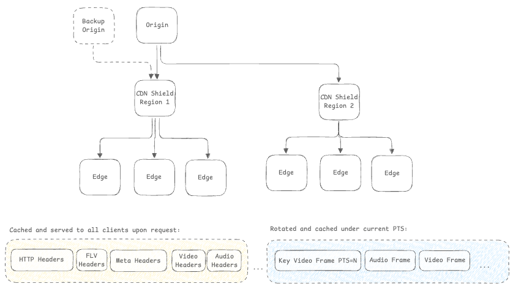
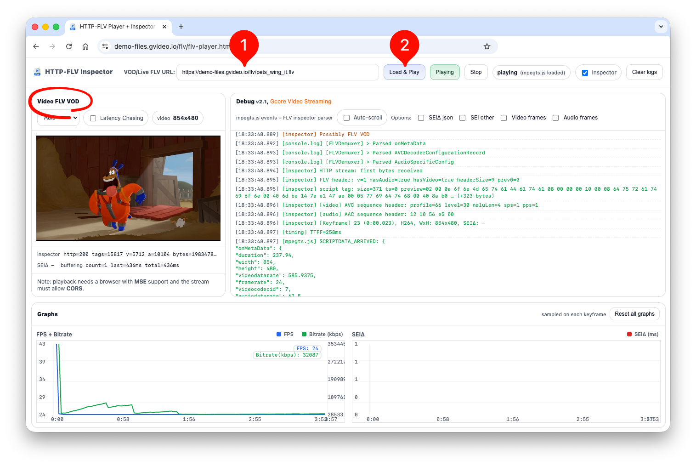

## Overview

FLV remains a critical protocol for live streaming and video-on-demand delivery, particularly in regions where low-latency, high-concurrency streaming is essential. Gcore CDN supports both **FLV Live** (real-time streaming) and **FLV VOD** (video-on-demand from static files) with distinct implementation paths and service models.

This guide provides precise configuration, protocol behavior, authentication patterns, and operational guidance for production deployments.

### Service Models

| Feature | FLV VOD | FLV Live |
|---------|---------|----------|
| **Use Case** | Pre-recorded video files | Real-time live streaming |
| **Activation** | Self-service | Requires support approval + sales agreement |
| **Configuration** | Generic CDN setup | Specialized streaming configuration |
| **Cache Model** | Standard static file caching | Sliding window buffer (RAM-based) |
| **Protocols** | HTTP/1.1, HTTP/2, HTTP/3 (QUIC) | HTTP/1.1, HTTP/2, HTTP/3 (QUIC) |

---

## FLV Live

### Opportunity

HTTP-FLV Live enables ultra-low-latency streaming with high concurrency tolerance, making it ideal for:

- **Live broadcasting** with 1-3 second latency
- **High-concurrency events** (100K+ simultaneous viewers per stream)

### Service Activation

<Info>
**IMPORTANT**: FLV Live is not available for self-service activation. It requires: **Sales Agreement**. 

Contact your account manager or sales@gcore.com. Please provide the following information:
   - Domain and company name
   - Content type (e.g., sports, news, entertainment)
   - Expected concurrent viewers per stream
   - Geographic distribution of viewers
   - Sample stream URL for testing
   - Broadcasting license or content compliance policy
</Info>

### Productization: HTTP-FLV Live Profile

FLV Live is delivered as a **dedicated service profile** with specialized CDN behavior. FLV delivery is achieved through a protocol HTTP-FLV.

HTTP-FLV protocol ensures continuous delivery of frames within a single infinitely long response from the server. Inside the stream, frames are scaled across the network instantly when they are received from the origin. HTTP-FLV is a pull-based streaming method in which the player requests an FLV file over HTTP.



### Configuration for FLV Live

#### Origin Requirements

Your origin must provide a valid FLV stream with the following characteristics:

**Stream Requirements**:
- **Container**: FLV (Flash Video).
- **FLV Headers**: Origin must prepare and return all necessary FLV headers, metadata, and data with PTS-aligned frames.
- **Timestamps**: Monotonic PTS/DTS.
- **Codecs**: Our CDN is codec-agnostic, providing transparent delivery of your media frames. You have the flexibility to utilize any standard or proprietary codec, including H.264 (AVC), H.265 (HEVC), and AAC.

**HTTP Response Codes**:
- All statuses returned to end-user as is.
- 200 code is cached.
- 4xx codes are not cached.
- 5xx codes are not cached.

### Formats and Query String Parameters

#### Base URL Format

```
https://play.yourdomain.com/flv/{stream-id}.flv
```

#### Query String Parameters

FLV Live supports the following query parameters for playback control:

| Parameter | Type | Description | Example |
|-----------|------|-------------|---------|
| `only_audio` | boolean | Play only audio track | `?only_audio=1` |
| `only_video` | boolean | Play only video track | `?only_video=1` |

### Authentication

FLV Live supports token-based authentication to prevent unauthorized access and hotlinking.

1. **Secure Token:**
   - Navigate to **CDN Resource** → **Security** → **Secure Token**
   - More information in [About Secure Token](http://gcore.com/docs/cdn/cdn-resource-options/security/use-a-secure-token/about-secure-token)

2. **Referer-based Access Control**
3. **User-Agent Filtering**
4. **Geo Filtering**

Get more information in [About Security](https://gcore.com/docs/cdn/cdn-resource-options/security/control-access-to-the-content-with-country-referrer-ip-and-user-agents-policies)


### Origin Failover Configuration

FLV Live supports automatic failover to backup origins:

Failover trigger examples:
- Origin connection timeout
- Origin returns `5xx` error
- Network unreachable to primary origin

### Observability and Monitoring

#### Per-Stream KPIs

**Metrics to Monitor**:
- **Traffic**: Traffic
- **Requests**: Requests
- **Error rate**: 4xx/5xx errors as % of total requests

**Access via**:
- Gcore Customer Portal → CDN → Statistics
- Grafana dashboards (if enabled)
- Raw logs export (for custom analysis)

### Player Compatibility

#### Player mpegts.js (flv.js)

**Browser Support**: Chrome, Firefox, Safari, Edge (via MSE)

**Implementation**:
```html
<script src="https://cdn.jsdelivr.net/npm/mpegts.js/dist/mpegts.min.js"></script>
<video id="videoElement" controls></video>

<script>
if (mpegts.isSupported()) {
    var videoElement = document.getElementById('videoElement');
    var flvPlayer = mpegts.createPlayer({
        type: 'flv',
        url: 'https://play.yourdomain.com/flv/channel1.flv',
        isLive: true,
        hasAudio: true,
        hasVideo: true,
        enableStashBuffer: false,
        autoCleanupSourceBuffer: true
    });
    flvPlayer.attachMediaElement(videoElement);
    flvPlayer.load();
    flvPlayer.play();
}
</script>
```

#### SRS Player

**Use Case**: Embedded player with built-in controls

```html
<script src="https://cdn.jsdelivr.net/npm/srs.sdk@1.2/dist/srs.sdk.min.js"></script>
<video id="srsPlayer" controls autoplay></video>

<script>
var player = new SrsPlayer('srsPlayer', {
    url: 'https://play.yourdomain.com/flv/channel1.flv',
    autoplay: true,
    live: true,
    bufferLength: 0.5  // 500ms latency target
});
player.on('error', function(err) {
    console.error('SRS Error:', err);
});
</script>
```

#### iOS/Android Native Implementation

**iOS (AVPlayer)**:
```swift
// FLV not natively supported on iOS
// Recommendation: Use HLS for iOS
// Or: Implement custom FLV parser with AVAssetResourceLoader
```

**Android (MediaPlayer)**:
```kotlin
// Option 1: Use ExoPlayer with FLV extension
implementation 'com.google.android.exoplayer:exoplayer:2.18.0'
implementation 'com.google.android.exoplayer:extension-flv:2.18.0'

// Option 2: Use ijkplayer (Bilibili player)
implementation 'tv.danmaku.ijk.media:ijkplayer-java:0.8.8'
```

**Browser Compatibility Matrix**:

| Player | Chrome | Firefox | Safari | Edge | Mobile Safari | Android Chrome |
|--------|--------|---------|--------|------|---------------|----------------|
| mpegts.js | ✅ | ✅ | ✅ | ✅ | ✅ (iOS 17+) | ✅ |
| SRS Player | ✅ | ✅ | ✅ | ✅ | ✅ (iOS 17+) | ✅ |
| Native | ✅ | ✅ | ✅ | ✅ | ✅ | ✅ |

### Scale and Performance Guidance

**Bandwidth Calculation**:
```
Total Bandwidth = Concurrent Viewers × Stream Bitrate × 1.2 (overhead)

Example:
- 50,000 concurrent viewers
- 2 Mbps stream bitrate
- Bandwidth = 50,000 × 2 Mbps × 1.2 = 120 Gbps
```

**Capacity Planning**:
- **Origin Shielding**: Reduces origin load by 80-95%
- **Multi-Region Origins**: Deploy origins in 2-3 regions for geographic redundancy
- **Capacity Reservation**: Pre-provision edge capacity 48 hours before event!

### FLV Live response example

```sh
curl -I -X GET "https://play.domain.com/flv/stream-id.flv"

HTTP/1.1 200 OK
Server: nginx
Date: Fri, 20 Jun 2025 19:31:29 GMT
Content-Type: video/x-flv
Transfer-Encoding: chunked
Connection: keep-alive
X-Cache-Status: Hit

FLV Header: {'signature': 'FLV', 'version': 1, 'has_video': True, 'has_audio': True}
[Script] Tag: 0, Size=867, Data=onMetaData
[Video header]: 0, Size: 52 (Keyframe, H264, AVC sequence header)
[Audio header]: 0, Size: 7
[Video]: 11154298 (185:54.298), Size: 24307 (Keyframe, H264, AVC NALU)
[Audio]: 11154359 (185:54.359), Size: 458
[Video]: 11154365 (185:54.365), Size: 1375 (Inter frame, H264, AVC NALU)
```

---

## FLV VOD

### Opportunity

FLV VOD enables delivery of pre-recorded video files with standard CDN caching benefits:

- **Cost-effective**: Leverages CDN edge caching (reduces origin bandwidth by 80-95%)
- **Self-service**: No special activation required
- **Global reach**: 210+ edge locations worldwide
- **Protocol flexibility**: HTTP/1.1, HTTP/2, HTTP/3 (QUIC) support
- **Security**: Full suite of CDN security features (DDoS protection, WAF, secure token)

**Common Use Cases**:
- Video-on-demand platforms
- Educational content delivery
- Archive/replay systems
- User-generated content hosting

### Configuration for FLV VOD

#### 1. Create CDN Resource

Standard CDN resource creation process: https://gcore.com/docs/cdn/about-cdn-resources-interface-how-it-is-arranged 

1. Navigate to [CDN Resources](https://cdn.gcore.com/resources/list)
2. Click **Create CDN Resource**
3. Configure origin:
   - **Origin Type**: Your server or Storage
   - **Origin Address**: `vod.example.com` or S3/Storage bucket
   - **Origin Protocol**: HTTP or HTTPS

#### 2. Enable Range Requests & Large File Optimization

FLV VOD delivery is optimized using HTTP range requests and Large File Delivery Optimization for files over 10 MB. This feature retrieves content in chunks, improves seeking performance, and reduces origin load.

1. Navigate to **CDN Resource** → **Content** → **Large files delivery optimization**.
2. Toggle **Enable Large files delivery optimization**.
3. Full instructions: [Optimize large file delivery](https://gcore.com/docs/cdn/cdn-resource-options/optimize-large-file-delivery)

#### 3. Security for FLV VOD

Security settings for FLV VOD (Secure Token, Geo-restriction, RBAC, etc.) are identical to FLV Live. Refer to the [Authentication](#authentication) section for implementation steps and token generation examples.

#### 4. Prefetch VOD

Use the **Prefetch** feature to load popular video files to the CDN cache before users request them. This ensures the first viewer gets a "HIT" status and experiences no origin-related latency.

1. Navigate to your CDN resource and select **Prefetch**.
2. Enter the paths to the files you wish to cache.
3. Click **Prefetch**.

Full instructions: [Load content to the CDN before users request it](https://gcore.com/docs/cdn/load-the-content-to-cdn-before-users-request-it)


### URL Format and Access

**Base URL**:
```
https://cdn.yourdomain.com/videos/{filename}.flv
```


### Usage Examples

#### Basic Video Delivery

**HTML5 Video Player**:

**Note**: Most modern browsers do not support FLV natively. Use mpegts.js (flv.js):

```html
<script src="https://cdn.jsdelivr.net/npm/mpegts.js/dist/mpegts.min.js"></script>
<video id="videoElement" controls width="640" height="360"></video>

<script>
if (mpegts.isSupported()) {
    var videoElement = document.getElementById('videoElement');
    var flvPlayer = mpegts.createPlayer({
        type: 'flv',
        url: 'https://cdn.yourdomain.com/videos/sample.flv',
        isLive: false  // VOD mode
    });
    flvPlayer.attachMediaElement(videoElement);
    flvPlayer.load();
}
</script>
```

#### Range Request Example

```bash
# Request first 1MB of video
curl -H "Range: bytes=0-1048575" \
  "https://cdn.yourdomain.com/videos/sample.flv" \
  -o sample-chunk.flv

# Expected response
HTTP/2 206 Partial Content
content-range: bytes 0-1048575/52428800
content-length: 1048576
x-cache-status: HIT
```


---

## Demo and Testing

### FLV Player Demo

Test your FLV LIVE streams and VOD files using the Gcore FLV demo video player:

**Demo URL**: [https://demo-files.gvideo.io/flv/flv-player.html](https://demo-files.gvideo.io/flv/flv-player.html)

**Features**:
- **FLV Live**: Real-time stream testing
- **FLV VOD**: Video file playback
- **Latency Measurement**: Shows end-to-end latency
- **Diagnostics**: Connection status, bitrate, dropped frames

**Usage**:
1. Enter your FLV URL:
   - Live: `https://play.yourdomain.com/flv/channel1.flv`
   - VOD: `https://cdn.yourdomain.com/videos/sample.flv`
   - or use our demo FLV VOD
2. Click **Load & Play** to start playback
3. Monitor diagnostics panel for performance metrics



---

## Configuration Checklist

### Pre-Production Validation (FLV Live)

- [ ] FLV Live service activated by Gcore support
- [ ] Origin encoder configured (H.264/AAC, 1-2s keyframes)
- [ ] CDN resource created with custom domain
- [ ] FLV Live preset enabled (RAM buffering)
- [ ] Secure token configured (optional)
- [ ] Backup origin configured for failover
- [ ] Test stream playback in demo player
- [ ] Monitoring alerts configured (error rate, latency)
- [ ] Capacity planning completed for expected concurrency

### Pre-Production Validation (FLV VOD)

- [ ] CDN resource created with origin configured
- [ ] Range requests enabled and tested
- [ ] Secure token configured (optional)
- [ ] Test file playback in demo player
- [ ] Cache hit rate >80% after warmup
- [ ] Geo-restriction or IP access control configured (optional)


---

## Additional Resources

- **[CDN Resource Configuration](/cdn/getting-started/create-a-cdn-resource)**: General CDN setup guide
- **[Secure Token Configuration](/cdn/cdn-resource-options/security/use-a-secure-token/configure-and-use-secure-token)**: Detailed authentication setup
- **[Origin Shielding](/cdn/cdn-resource-options/general/enable-and-configure-origin-shielding)**: Reduce origin load for high-traffic streams
- **[Live Streaming Overview](/cdn/cdn-resource-options/configure-live-streams-and-video-delivery-via-cdn-only-for-paid-tariffs)**: HLS live streaming setup
- **[CDN Statistics](/cdn/view-statistics-of-a-cdn-resource)**: Monitor performance and usage

