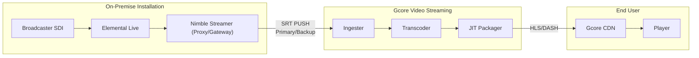
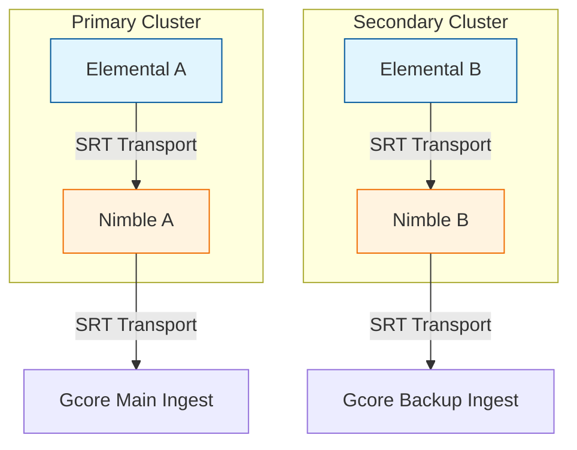
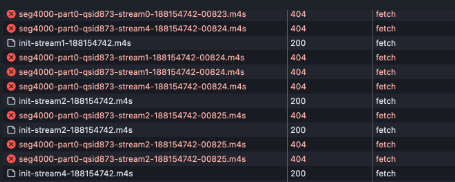

## Overview

This case study showcases how a high-complexity 24/7 streaming pipeline for major live events was successfully solved. The architecture demonstrates mastery over "hot-swapping"—the seamless switching from a main signal to a dedicated separate broadcast without interrupting the user experience.

By aligning professional-grade encoders with platform-side real-time monitoring, the solution ensures that even the most complex transitions remain stable across Global Ingest points. 

This incident highlights a critical lesson: in high-stakes broadcasting, even a single missed parameter or minor misconfiguration on the encoder side can have a critical impact on the entire 24/7 broadcast.

## Architecture: From SDI to Playback

The following scheme illustrates the complete chain of professional signal delivery:



## Encoder Stack & Setup

To handle millions of viewers during national events initially there was implemented a robust multi-tier setup:

1. **Main Composition, AWS Elemental Live**: Handles the SDI master signal and placeholder file composition. 
2. **SRT Gateway & Encoder, Nimble Streamer**: Nimble Streamer acts as the intelligent gateway, utilizing hardware-accelerated encoding for the final push to Gcore Video Streaming.

### The Ingest Pipeline

The primary and backup flows are segregated but mirrors of each other, ensuring that a failure in one stack does not affect the other.



### Global Cross-Pull Redundancy

To prevent total signal loss if a single Elemental source fails, the Nimble gateway layer implements a cross-pull mechanism. This ensures that even if one Elemental encoder drops, both Gcore Ingest points still receive a valid signal.

If Elemental A fails, Nimble A automatically switches to receiving Elemental B's feed from Nimble B via SRT:
```text
Elemental A -> Nimble A -> Nimble B
Elemental B -> Nimble B -> Nimble A
```


## RTMP vs. SRT: Choosing the Right Tool

While RTMP is the industry legacy, this case illustrates why **SRT is mandatory** for high-complexity TV delivery:
- **RTMP (TCP)**: Unlimited retransmissions cause "head-of-line blocking." If one packet is late, the entire stream stalls, leading to large, unpredictable latency spikes that break sync.
- **SRT (UDP + ARQ)**: Allows the ingest layer to handle late packets within a strict window. If a packet is lost, SRT retransmits it immediately without stalling the entire feed. This is vital for "hot-swapping" where timing must be absolute.

## Case Investigation: From 404 to PTS Fix

### Initial Symptoms
The issue was first noted by monitoring system and later confirmed by end-users as intermittent **buffering** and **stalled playback**.
- **CDN Logs**: CDN reported `404` errors received from the upstream. 
- **Player**: Analysis showed `404 Not Found` for specific `.m4s` (DASH) segments.
- **Initial Assumption**: Because segments were missing, it was initially suspected to be a transcoding issue or a JIT Packager failure.



### Real-time Investigation Lifecycle

1.  **Traffic Audit**: We confirmed that segments were indeed missing from the origin buffer, not just the CDN cache.
2.  **Ingester Validation**: Using SRT statistics, we noted that the bitrate remained stable, but "Late packet" drops were occurring exactly during source transitions.
3.  **PTS/DTS Analysis**: We deployed our internal PTS/DTS stream monitor and detected that the PTS stalled and lost for several frames during the switch from the placeholder loop to the SDI feed.

## Solution: Real-Time Monitoring & Config

### 1. Gcore PTS/DTS Stream Monitor

We developed a dedicated stream monitor worker for PTS/DTS analysis that performs real-time timestamp analysis. This worker proactively flags AV sync drifts (>200ms) and timeline stalls, allowing us to notify broadcasters before small drifts become major 404 errors.

Below is an excerpt from the monitor logs demonstrating the exact moment of the timeline stall:

```log
datetime,               pts,            pts_time,     status
[2026-01-01 08:57:24],  8589935840,     95443.731556
[2026-01-01 08:57:24],  8776246432,     97513.849244  <-- PTS FROZEN
[2026-01-01 08:57:24],  8776246432,     97513.849244
...
[2026-01-01 09:31:43],  8776246432,     97513.849244
[2026-01-01 09:31:47],  8776246432,     97513.849244  <-- NO FRAMES (4s GAP)
[2026-01-01 09:31:47],  8776246432,     97513.849244  <-- PTS UNFROZEN
[2026-01-01 09:31:47],  8775620240,     97506.891556
```

### 2. SRT Latency & Stability

Correctly sizing the SRT `latency` parameter is critical. In the analyzed case, the encoder was initially using the **default value of 120ms**—a setting optimized for low-jitter local networks (Ethernet). 

While 120ms works in a controlled lab environment, it leaves almost no room for packet retransmission over the public internet. During even minor network fluctuations or high-CPU source switches, packets that arrived "late" (after 120ms) were dropped by the ingest layer, resulting in the 404 errors observed in the segments. 

- [Deep Dive: SRT Latency and Buffer Management](/streaming/live-streaming/protocols/srt#srt-latency)

### 3. Encoder Configuration Best Practices

The investigation concluded that two critical adjustments were required to ensure seamless hot-swapping:

**For AWS Elemental Live:**
- **Timecode Source**: Must be set to **System-Clock**. This ensures a monotonic timeline and prevents PTS stalls during source switches (e.g., from placeholder to SDI).

**For Nimble Streamer SRT Gateway:**
- **Setup**: Configured in "Pass-through" mode for internal transport to minimize latency, with hardware-accelerated encoding only for the final handoff.
- **SRT Parameters**: Use a `latency` of **2000-2500ms** (minimum) for public internet transport and `mode=caller`. This provides the necessary buffer for ARQ retransmissions, ensuring 100% data integrity before processing.
- **Keyframe Interval**: Must be set to **1 second** on the encoder side to ensure rapid recovery and synchronization during hot-swapping events.

## Conclusion & Resources

Mastering a 24/7 broadcast requires treating your ingest as a precision-timed system. By utilizing SRT's selective retransmissions and ensuring monotonic timestamps, you can handle complex source transitions with 100% confidence.

**Our Recommendation**: Before any major 24/7 live event, always perform a full-scale test-run including simulated "hot-swaps" between your primary and fallback signals. 

At Gcore, our advantage is our **client-oriented service**. If you are planning a high-profile broadcast or need assistance with your encoder configuration, don't hesitate to reach out to our engineers. We are here to help you build the most resilient pipeline for your audience.

### Further Reading
- **[SRT Protocol](/streaming/live-streaming/protocols/srt)**: Detailed setup for software and hardware encoders.
- **[PTS/DTS Timestamps](/streaming/live-streaming/pts-dts)**: Why invalid timestamps break CDN delivery and DASH packaging.
- **[RTMP vs SRT Comparison](/streaming/live-streaming/protocols/rtmp-srt)**: Choosing the best protocol for your unstable uplink.

By following these best practices, you can ensure a premium QoE for millions of end-users during business-critical broadcasts.
