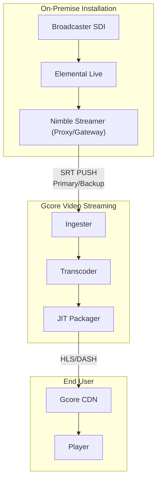
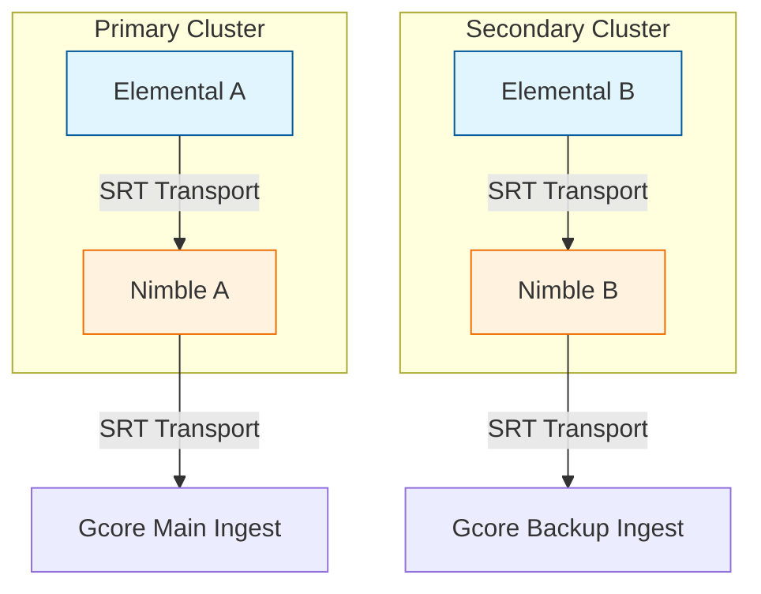

Hot-swapping between redundant encoders can fail even when both ingest paths remain available. In this production setup with AWS Elemental Live and Nimble Streamer, source transitions caused intermittent buffering and missing DASH segments.

## Architecture

The pipeline moves the SDI signal from on-premise encoders through the SRT transport layer into Gcore Video Streaming, then out to viewers via CDN:


```mermaid
graph TD
    subgraph "On-Premise Installation"
    A["Broadcaster SDI"] --> B["Elemental Live"]
    B --> C["Nimble Streamer (Proxy/Gateway)"]
    end

    subgraph "Gcore Video Streaming"
    C -- "SRT PUSH<br/>Primary/Backup" --> D["Ingester"]
    D --> E["Transcoder"]
    E --> F["JIT Packager"]
    end

    subgraph "End User"
    F -- HLS/DASH --> G["Gcore CDN"]
    G --> H["Player"]
    end
```

The on-premise ingest pipeline uses two components:

1. **AWS Elemental Live** handles the SDI master signal and placeholder file composition.
2. **Nimble Streamer** acts as the SRT gateway, using hardware-accelerated encoding for the final push to Gcore Video Streaming.

Each Elemental–Nimble stage is duplicated to provide an independent primary and backup ingest path:


```mermaid
graph TD
    subgraph "Primary Cluster"
        EA["Elemental A"] -- "SRT Transport" --> NA["Nimble A"]
    end

    subgraph "Secondary Cluster"
        EB["Elemental B"] -- "SRT Transport" --> NB["Nimble B"]
    end

    NA -- "SRT Transport" --> GMain["Gcore Main Ingest"]
    NB -- "SRT Transport" --> GBackup["Gcore Backup Ingest"]

    style EA fill:#e1f5fe,stroke:#01579b
    style EB fill:#e1f5fe,stroke:#01579b
    style NA fill:#fff3e0,stroke:#ef6c00
    style NB fill:#fff3e0,stroke:#ef6c00
```

### Cross-pull redundancy

When a single Elemental source fails, the Nimble gateway layer implements a cross-pull so both Gcore Ingest points still receive a valid signal.

In normal operation, each Nimble instance forwards its local Elemental feed to Gcore:

```text
Normal:
Elemental A → Nimble A → Gcore Main Ingest
Elemental B → Nimble B → Gcore Backup Ingest
```

When Elemental A fails, Nimble A pulls the Elemental B feed from Nimble B via SRT:

```text
On Elemental A failure:
Elemental B → Nimble B → Gcore Backup Ingest
                      ↘ (cross-pull to Nimble A)
Nimble A ─────────────── Gcore Main Ingest
```

## Troubleshoot failed hot-swaps

### Symptoms

CDN logs show `404` responses from upstream. Player analysis identifies missing `.m4s` DASH segments. End-users report intermittent buffering and stalled playback. Because segments are absent at the origin, initial investigation typically focuses on the transcoder or JIT Packager.

<Frame></Frame>

### Identify the failure

The failure was isolated at three points in the delivery path:

1. **CDN and origin**: Segments were confirmed missing from the origin buffer, not the CDN cache alone — ruling out a CDN-layer failure.
2. **SRT ingest**: SRT statistics showed stable overall bitrate, but "Late packet" drops coincided exactly with source transitions.
3. **PTS/DTS timestamp**: The PTS/DTS stream monitor detected a PTS (Presentation Time Stamp) stall lasting approximately 34 minutes during the switch from the placeholder loop to the SDI feed.

### Root cause

Two encoder misconfigurations caused the failure:

- **SRT latency too low**: The encoder used the default 120 ms latency — a setting for low-jitter local networks. On a public internet path, packets arriving after 120 ms were dropped by the ingest layer, destabilizing the input timeline during source transitions.
- **Incorrect timecode source**: Elemental Live was not set to System-Clock as the timecode source. During a source switch — from a placeholder loop to the live SDI feed — the timecode reference changed, causing PTS values to stall.

Both misconfigurations produced a single failure chain:

> late packet drops during source transition → unstable input timeline → PTS stall → transcoder stops producing output segments → missing segments at origin → CDN reports `404`

## Configure hot-swapping

### AWS Elemental Live

- **Timecode Source**: Set to **System-Clock**. This maintains a monotonic timeline and prevents PTS stalls when switching between sources — from a placeholder loop to the live SDI feed, for instance.
- **Keyframe Interval**: Set to **1 second** to allow rapid recovery and synchronization during hot-swapping events.

### Nimble Streamer

- **Setup**: Configure in "Pass-through" mode for internal transport to minimize latency, with hardware-accelerated encoding only for the final handoff to Gcore.
- **SRT latency**: Use at least 2000 ms (this deployment used 2000–2500 ms) for public internet transport. Set `mode=caller`.
- **Keyframe Interval**: Match the encoder-side setting of **1 second**.

### Why SRT latency matters

SRT uses UDP with selective ARQ (Automatic Repeat reQuest). Lost packets are retransmitted within the configured latency window; packets that arrive after the window expires are dropped rather than held. This keeps the stream timeline stable — but only when the window is large enough to absorb jitter during a source transition on a public internet path.

At 120 ms, the window was too narrow. During a hot-swap, the brief CPU and network spike caused packets to arrive late and be dropped. The resulting gap in the input stream destabilized the PTS and stopped transcoder output. At 2000–2500 ms, the retransmission window absorbs the transition spike without drops.

The [SRT&nbsp;latency&nbsp;configuration](/streaming/live-streaming/protocols/srt#configure-srt-latency) article covers how to size this value for different network conditions.

## Detect PTS stalls

The Gcore PTS/DTS stream monitor flags AV sync drift (>200 ms) and timeline stalls, providing an early signal of timestamp problems before they disrupt downstream processing.

The log excerpt below shows the stall. The `...` represents approximately 34 minutes of frozen PTS entries between the stall onset and recovery. The final line reflects the PTS reset to a new ingest cycle reference:

```log
datetime,               pts,            pts_time,     status
[2026-01-01 08:57:24],  8589935840,     95443.731556
[2026-01-01 08:57:24],  8776246432,     97513.849244  <-- PTS FROZEN
[2026-01-01 08:57:24],  8776246432,     97513.849244
...
[2026-01-01 09:31:43],  8776246432,     97513.849244
[2026-01-01 09:31:47],  8776246432,     97513.849244  <-- NO FRAMES (4s GAP)
[2026-01-01 09:31:47],  8776246432,     97513.849244  <-- LAST FROZEN PTS
[2026-01-01 09:31:47],  8775620240,     97506.891556  <-- PTS RESET (new ingest cycle reference)
```

For assistance with encoder configuration or high-profile broadcast support, contact [Gcore&nbsp;support](mailto:support@gcore.com).
